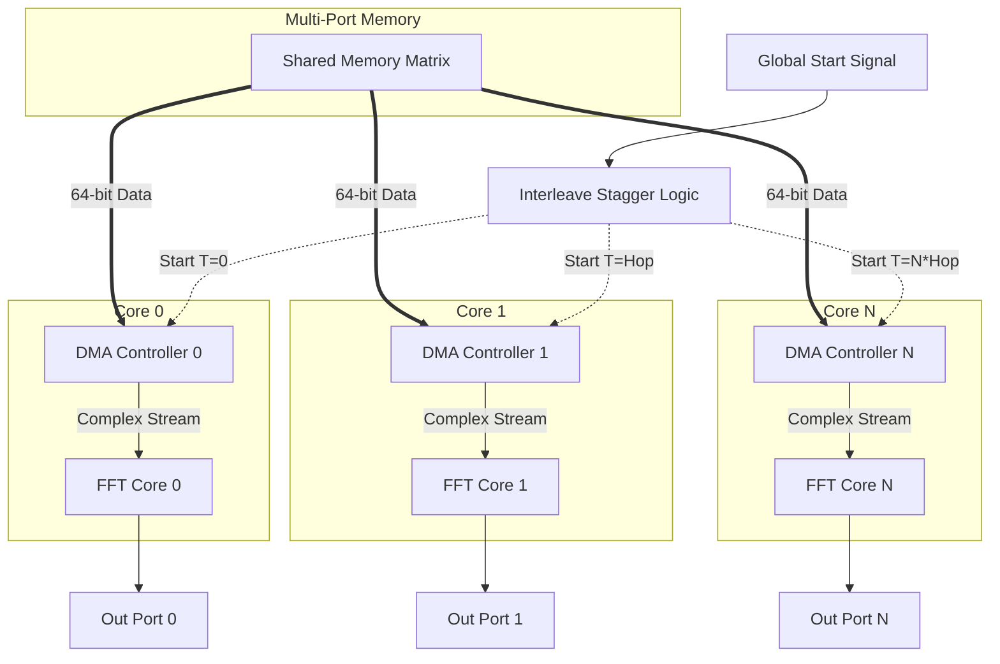

# Multi-Core Interleaved FFT Architecture in SystemC

  

A pipelined, cycle-accurate **Multi-Core Interleaved Fast Fourier Transform (FFT)** implementation in SystemC. This architecture utilizes the Decimation-In-Frequency (DIF) radix-2 butterfly algorithm and features dedicated Direct Memory Access (DMA) controllers for each FFT core, operating on a shared multi-port memory.

## Table of Contents

- [Overview](#overview)
- [Summary of Modules](#summary-of-modules)
- [Architecture Diagram](#architecture-diagram)
- [Building and Running (Makefile)](#building-and-running-makefile)
- [Project Structure](#project-structure)
- [Algorithm Description](#algorithm-description)

---

## Overview

This project provides a **Multi-Core Interleaved FFT Processor** that can process continuous streams of data by temporally interleaving the execution of multiple independent FFT cores. 

### Key Features
- ✅ **Interleaved Multi-Core Design**: Scales throughput by instantiating multiple DMA-FFT core pairs.
- ✅ **Staggered Execution**: Cores are started with a configurable `HOP_SIZE` delay, ensuring continuous, parallel processing without pipeline stalls.
- ✅ **Dedicated DMA Channels**: Each core is fed by its own DMA controller unpacking 64-bit multi-port memory words on-the-fly.
- ✅ **0-Cycle Compute Butterfly**: Computation is purely combinational, resulting in an ultra-low-latency pipeline.
- ✅ **Completely Parametrizable**: FFT Size (N), Number of Cores, memory depth, and data/address widths are fully configurable templates.

---

## Summary of Modules

The codebase is highly modular, split into distinct SystemC modules focused on different stages of the data path. Below is a summary of all existing modules:

### 1. `InterleavedFFT` (`interleaved_fft.h`)
The top-level processor module. It instantiates `NUM_CORES` pairs of DMA controllers and FFT cores. It manages the temporal interleaving logic, staggering the start signal by `HOP_SIZE` clock cycles across the cores to maximize throughput.

### 2. `FFT` (`fft.h`)
The fundamental N-point FFT core pipeline. It dynamically instantiates `log₂(N)` pipeline stages, tracks cumulative latency, and generates internal pipeline synchronization logic. It outputs transformed data at a rate of 1 sample/cycle after the initial pipeline latency.

### 3. `Stage` (`stage.h`)
Represents a single step in the FFT DIF decomposition. It operates in a two-phase pipeline per internal cycle:
- **Phase 1 (Store & Forward)**: Buffers incoming inputs and outputs the pre-calculated difference from the previous block.
- **Phase 2 (Compute)**: Fetches paired data, computes the butterfly inline, immediately outputs the sum, and saves the difference.

### 4. `DMA` (`dma.h`)
A Direct Memory Access controller responsible for streaming data from the shared memory to the FFT core. It tracks memory addresses, requests 64-bit words, unpacks them into native double-precision `complex_t` numbers, and handles pipeline synchronization delays seamlessly.

### 5. `Memory` (`memory.h`)
A generic parameterized Multi-Port Memory block. Supports a single synchronous write port and an arbitrary `NUM_PORTS` amount of synchronous read ports, serving as the data backplane for the multi-core DMA interfaces.

### 6. Custom Data Types (`fft_types.h`)
Provides a custom `complex_t` struct (using double precision) equipped with operator overloading for smooth integration with SystemC signals and VCD wave tracing.

---

## Architecture Diagram



---

## Building and Running (Makefile)

The project includes a `Makefile` for compiling the simulation executables and managing build artifacts. 

### Prerequisites
- **SystemC**: Version 2.3.x or later.
- **Environment Variable**: `SYSTEMC_HOME` must point to your SystemC installation directory (e.g., `/home/user/systemc-2.3.3`).

### Makefile Commands

#### 1. Compile the Main Simulation
Compiles the complete interleaved multi-core FFT system (`main.cpp` + `tb_interleaved_fft.h`).
```bash
make
```
*This generates an executable located at `build/main`.*

#### 2. Run the Main Simulation
Executes the compiled multi-core system and automatically pipes the standard output into a log file inside the `out/log/` folder. It also outputs VCD wave trace files to `out/vcd/`.
```bash
make run
```
Optionally, specify a custom log name:
```bash
make run SIM_NAME=my_custom_test
```

#### 3. Compile the Standalone FFT Core Testbench
If you just want to test a single, isolated FFT core (`tb_fft.cpp`) without the DMA or Multi-core wrappers:
```bash
make build/tb_fft
```

#### 4. Run the Standalone FFT Core Testbench
Executes the isolated FFT testbench:
```bash
make run_fft_tb
```

#### 5. Clean Build Artifacts
Removes all compiled object files and the `build/` directory to ensure a fresh compilation state.
```bash
make clean
```

---

## Project Structure

```text
Project_FFT/
├── build/                  # Compiled executables and object files
├── out/
│   ├── log/                # Simulation log files
│   └── vcd/                # VCD wave trace files
├── Makefile                # Primary build configuration
├── README.md               # Architecture and execution guide
├── main.cpp                # Main simulation entry point
├── fft_types.h             # Complex numbers and SystemC tracing
├── stage.h                 # Single FFT pipeline stage
├── fft.h                   # Single N-point FFT core
├── dma.h                   # DMA memory controller
├── memory.h                # Multi-port shared memory
├── interleaved_fft.h       # Top-level Interleaved Multi-Core wrappers
├── tb_interleaved_fft.h    # Comprehensive Top-Level Testbench
├── tb_fft.cpp              # Standalone unit testbench for FFT Core
├── tb_dma.*                # Unit testbenches for DMA
└── tb_memory.h             # Unit testbenches for Memory
```

---

## Algorithm Description

The implementation utilizes a **Decimation-In-Frequency (DIF)** pipeline. 

For an N-point FFT, the pipeline consists of **log₂(N)** independent stages connected serially.
- **Stage 0**: Processes sequence blocks of size N
- **Stage 1**: Processes sequence blocks of size N/2
- ...
- **Stage log₂(N)-1**: Processes sequence blocks of size 2

### Output Ordering
Due to the DIF algorithm, the final spectral outputs naturally emerge in **bit-reversed order**. For instance, with N=8, the output bins appear as: `0, 4, 2, 6, 1, 5, 3, 7`.

### Pipeline Timing
The pipeline accepts 1 new input per internal cycle. Initial latency before the first output appears is defined by the following formula:
`Latency ≈ N + 2*log₂(N) - 1 cycles`

---
