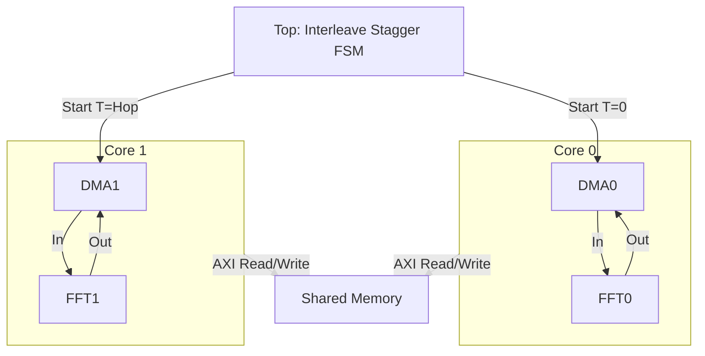

# Multi-Core Interleaved FFT Architecture in SystemC

A pipelined, cycle-accurate **Multi-Core Interleaved Fast Fourier Transform (FFT)** implementation in SystemC. This architecture utilizes the Decimation-In-Frequency (DIF) radix-2 butterfly algorithm cascade, where each compute core is paired with a dedicated AXI4 DMA controller.

## Table of Contents

- [Overview](#overview)
- [Summary of Modules](#summary-of-modules)
- [Architecture Diagram](#architecture-diagram)
- [Building and Running](#building-and-running)
- [Project Structure](#project-structure)
- [Algorithm Description](#algorithm-description)

---

## Overview

This project implements a **Multi-Core Interleaved FFT Processor** that processes continuous streams of data by temporally interleaving the execution of multiple independent FFT cores.

### Key Features
- **Interleaved Multi-Core Design**: Scalable performance by instantiating multiple DMA-FFT core pairs.
- **Staggered Execution**: Launches cores with a configurable `HOP_SIZE` delay to optimize memory bus utilization.
- **Dedicated DMA Channels**: Independent DMA controllers stream data, performing packing and unpacking of memory words.
- **Optimized Butterfly Stage**: Employs lookup tables for precomputed twiddle factors to eliminate runtime trigonometric overhead.
- **Fully Parametrized**: Customize FFT Size (N), Core Count, memory depth, and data/address widths via templates.

---

## Summary of Modules

### 1. `Top` ([top.h](file:///home/golakoti/FFT_SystemC/top.h))
The top-level processor wrapper. It instantiates the array of cores and manages the execution flow. When a global start trigger is received, the staggering state machine fires `start` signals to individual cores delayed by `HOP_SIZE` cycles. This staggers the bus access cycles, smoothing memory bandwidth requirements and enabling parallel, interleaved throughput.

### 2. `Core` ([core.h](file:///home/golakoti/FFT_SystemC/core.h))
A module-level wrapper connecting one `DMA` controller and one `FFT` core. It routes the clock, reset, and control inputs to both blocks, binds the external AXI read and write masters to top-level ports, and connects the DMA to the FFT processing core via point-to-point handshake channels.

### 3. `FFT` ([fft.h](file:///home/golakoti/FFT_SystemC/fft.h))
The primary N-point FFT computation core. It recursively instantiates a series of `log₂(N)` butterfly stages to implement the decimation-in-frequency radix-2 butterfly cascade. It sets up clock, reset, and serial connection signals between each stage, outputting the calculated frequency bins in bit-reversed order.

### 4. `Stage` ([stage.h](file:///home/golakoti/FFT_SystemC/stage.h))
A single processing stage of the FFT cascade. It runs a loop that alternates between:
- **Store & Forward**: Buffering incoming inputs into an internal feedback delay line while outputting previously stored butterfly differences.
- **Compute**: Performing radix-2 butterfly calculations using precomputed twiddle factors retrieved from a local lookup table to avoid dynamic `cos` and `sin` calls. It supports resource-constrained latency modeling.

### 5. `DMA` ([dma.h](file:///home/golakoti/FFT_SystemC/dma.h))
A dedicated controller orchestrating memory transfers for its associated FFT core. It runs three parallel threads:
- **Address Generation**: Pushes read requests onto the AXI AR channel.
- **Read Streaming**: Pops read data beats, unpacks them into C++ complex variables, and feeds them into the FFT core, flushing the pipeline with zero-padding as needed.
- **Write-back Streaming**: Pops results from the FFT core, packs them into AXI data beats, writes them to memory via the AXI AW/W channels, and pops write responses.

### 6. `Memory` ([memory.h](file:///home/golakoti/FFT_SystemC/memory.h))
A generic multi-port SRAM simulation model supporting multiple AXI4 read and write slave ports. It spawns independent thread processes for each read and write port to respond to incoming AXI transactions (AR/R and AW/W/B handshakes) concurrently.

### 7. Custom Data Types ([fft_types.h](file:///home/golakoti/FFT_SystemC/fft_types.h))
Defines the `complex_t` struct with standard operator overloading for complex arithmetic. It also provides the `pack_complex` and `unpack_complex` template functions used across the testbench, DMA, and monitor modules to slice and pack real and imaginary parts into AXI data words of configurable widths (e.g., 32-bit real-only or 64-bit real/imaginary).

---

## Architecture Diagram


```mermaid
flowchart

ControlLogic[Top: Interleave Stagger FSM] 
ControlLogic -->|Start T=0| DMA0
ControlLogic -->|Start T=Hop| DMA1

subgraph s1["Core 0"]
		DMA0 -->|"In"| FFT0
        FFT0 -->|"Out"| DMA0
end

subgraph s2["Core 1"]
		DMA1 -->|"In"| FFT1
        FFT1 -->|"Out"| DMA1
end

mem["Shared Memory"]
s1 -->|"AXI Read/Write"| mem
s2 -->|"AXI Read/Write"| mem
```

---

## Modules

* **Top** [src/top.h]: Wraps the core array and schedules launch triggers staggered by `HOP_SIZE` cycles to prevent concurrent memory access conflicts.
* **Core** [src/core.h]: Sub-wrapper binding one DMA controller to one FFT compute block via point-to-point handshake channels.
* **FFT** [src/fft.h]: N-point DIF compute pipeline recursively instantiating `log2(N)` butterfly stages.
* **Stage** [src/stage.h]: A single butterfly execution stage utilizing a feedback delay line buffer and a precomputed twiddle factor lookup table.
* **DMA** [src/dma.h]: AXI4 master interface driving read address generation, data unpacking/zero-padding, and write-back streaming for its compute core.
* **Memory** [src/memory.h]: Single port SRAM simulation model responding to concurrent AXI read/write transactions.
* **fft_types.h** [src/fft_types.h]: Custom complex type declarations (`complex_t`) and AXI serialization helpers.

---

## Building and Running

### Prerequisites
* SystemC 2.3.x or later.
* Environment variable `SYSTEMC_HOME` set to the SystemC installation path.

### Build and Run Targets

Build targets are provided in the [Makefile]:

* **Compilation**: Compiles the default staggered multi-core system:
  ```bash
  make run
  ```
* **FFT Core Unit Test**: Verifies the standalone compute engine:
  ```bash
  make run_fft_tb
  ```
* **DMA Unit Test**: Verifies DMA channel handshakes:
  ```bash
  make run_dma_tb
  ```
* **SRAM Memory Unit Test**: Verifies single-port slave memory:
  ```bash
  make run_mem_tb
  ```
* **System Simulation**: Verifies the complete multi-core interleaved FFT system:
  ```bash
  make run_system
  ```
* **Clean Artifacts**:
  ```bash
  make clean
  ```

### Automated Multi-Configuration Tests

Use [run_tests.py] to compile and execute a suite of test scenarios with varying core counts, FFT sizes, and memory layouts:

To run the automated tests:
```bash
python3 run_tests.py --config test_configs.json
```

#### Verification Flow

For each scenario defined in the configuration file, the test runner performs the following steps:
1. **Clean Rebuild**: Cleans target build artifacts (`tb_system.o` and `tb_system`) to ensure clean compilation.
2. **Dynamic Compilation**: Re-compiles `test/tb_system.cpp` by passing scenario parameters as compiler macros:
   * `-DFFT_N`: The FFT point size (e.g. 1, 2, 4, 8, 16, 1024).
   * `-DFFT_NUM_CORES`: Number of instantiated cores.
   * `-DFFT_HOP`: Start delay (cycles) between sequential cores.
   * `-DFFT_SAMPLES`: Total samples to process.
   * `-DFFT_NUM_MULT` / `-DFFT_NUM_ADD`: Multiplier and adder resource limitations.
   * `-DUSE_SLAVE_FROM_FILE`: Condition flag if using pre-defined signal inputs.
3. **Stimulus Generation**: If `use_file_stim` is true, and stimulus file is available at `out/test_runs/<case_name>/stimulus_core_<core_id>.csv`, then it is used. Otherwise the script calls `generate_stimulus.py` to generate periodic input signals (such as sine, multi-tone, square, triangle, or complex exponentials) matching the core's scenario requirements.
4. **Execution & Log Capture**: Runs the compiled binary and captures standard output, standard error, and exit codes. Outputs are logged to `out/test_runs/<case_name>/sim_log.txt`.
5. **VCD Tracing**: Saves VCD waveforms of AXI channels and internal registers to `out/test_runs/<case_name>/trace.vcd` for wave visualization.
6. **Result Validation**: Scans simulation output logs for verification success indicators (`TESTBENCH PASS`).
7. **Signal Visualization**: Plots time-domain signals and frequency-domain computed FFT bins. Saving plots under `out/test_runs/<case_name>/img/`.
8. **Summary Table**: Outputs a tabular summary showing the status (PASSED/FAILED) and execution duration of each scenario.

#### Test Configuration Schema (`test_configs.json`)

Test cases are defined as an array of JSON objects with the following schema:
```json
[
  {
    "case": "scenario_name",
    "params": {
      "N": 8,
      "NUM_CORES": 2,
      "HOP": 1,
      "NUM_MULS": 4,
      "NUM_ADDS": 6,
      "SAMPLES": 256,
      "use_file_stim": true,
      "fs": 128.0
    }
  }
]
```
* `HOP`, `NUM_MULS`, `NUM_ADDS`, `fs` are optional parameters. If not provided, default values will be used.
---

## Project Structure

```text
FFT_SystemC/
├── Makefile            # Primary build configuration
├── README.md           # Architecture and execution guide
├── test_configs.json   # Parameter configurations for automated runner
├── run_tests.py        # Automated test runner script
├── src/                # Core C++ source files
│   ├── fft_types.h     # Complex types and AXI serialization
│   ├── stage.h         # Radix-2 DIF pipeline stage
│   ├── fft.h           # Cascaded stages block
│   ├── dma.h           # DMA memory streaming block
│   ├── memory.h        # Single-port SRAM model
│   ├── top.h           # Top wrapper coordinator
│   ├── core.h          # Core integration block
│   └── monitor.h       # AXI port activity monitor
└── test/               # Testbenches and test drivers
    ├── main.cpp        # Standalone entry point
    ├── tb_top.h        # Integrated top-level testbench
    ├── tb_fft.cpp      # Standalone FFT core unit test
    ├── tb_dma.h        # DMA testbench declaration
    ├── tb_dma.cpp      # DMA testbench driver
    ├── tb_memory.h     # Memory testbench declaration
    ├── tb_memory.cpp   # Memory testbench driver
    └── tb_system.cpp   # Full system verification testbench
```

---

## Algorithm Description

The implementation utilizes a **Decimation-In-Frequency (DIF)** pipeline. For an $N$-point FFT, the pipeline consists of $\log_2(N)$ independent stages connected serially.
* **Stage 0**: Processes sequence blocks of size $N$
* **Stage 1**: Processes sequence blocks of size $N/2$
* ...
* **Stage $\log_2(N)-1$**: Processes sequence blocks of size 2

### Output Ordering
Due to the DIF algorithm, the final spectral outputs emerge in **bit-reversed order**. For instance, with $N=8$, the output bins appear as: `0, 4, 2, 6, 1, 5, 3, 7`.
