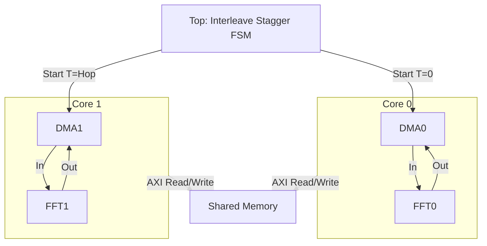

# Multi-Core Interleaved FFT Architecture in SystemC

A pipelined, cycle-accurate **Multi-Core Interleaved Fast Fourier Transform (FFT)** implementation in SystemC. This architecture utilizes the Decimation-In-Frequency (DIF) radix-2 butterfly algorithm and features dedicated Direct Memory Access (DMA) controllers for each FFT core, operating on a shared multi-port memory.

## Table of Contents

- [Overview](#overview)
- [Summary of Modules](#summary-of-modules)
- [Architecture Diagram](#architecture-diagram)
- [Building and Running](#building-and-running)
- [Project Structure](#project-structure)
- [Algorithm Description](#algorithm-description)

---

## Overview

This project implements a **Multi-Core Interleaved FFT Processor** that processes continuous streams of data by temporally interleaving the execution of multiple independent FFT cores.

### Key Features
- **Interleaved Multi-Core Design**: Scalable performance by instantiating multiple DMA-FFT core pairs.
- **Staggered Execution**: Launches cores with a configurable `HOP_SIZE` delay to optimize memory bus utilization.
- **Dedicated DMA Channels**: Independent DMA controllers stream data, performing packing and unpacking of memory words.
- **Optimized Butterfly Stage**: Employs lookup tables for precomputed twiddle factors to eliminate runtime trigonometric overhead.
- **Fully Parametrized**: Customize FFT Size (N), Core Count, memory depth, and data/address widths via templates.

---

## Summary of Modules

### 1. `Top` ([top.h](file:///home/golakoti/FFT_SystemC/top.h))
The top-level processor wrapper. It instantiates the array of cores and manages the execution flow. When a global start trigger is received, the staggering state machine fires `start` signals to individual cores delayed by `HOP_SIZE` cycles. This staggers the bus access cycles, smoothing memory bandwidth requirements and enabling parallel, interleaved throughput.

### 2. `Core` ([core.h](file:///home/golakoti/FFT_SystemC/core.h))
A module-level wrapper connecting one `DMA` controller and one `FFT` core. It routes the clock, reset, and control inputs to both blocks, binds the external AXI read and write masters to top-level ports, and connects the DMA to the FFT processing core via point-to-point handshake channels.

### 3. `FFT` ([fft.h](file:///home/golakoti/FFT_SystemC/fft.h))
The primary N-point FFT computation core. It recursively instantiates a series of `log₂(N)` butterfly stages to implement the decimation-in-frequency radix-2 butterfly cascade. It sets up clock, reset, and serial connection signals between each stage, outputting the calculated frequency bins in bit-reversed order.

### 4. `Stage` ([stage.h](file:///home/golakoti/FFT_SystemC/stage.h))
A single processing stage of the FFT cascade. It runs a loop that alternates between:
- **Store & Forward**: Buffering incoming inputs into an internal feedback delay line while outputting previously stored butterfly differences.
- **Compute**: Performing radix-2 butterfly calculations using precomputed twiddle factors retrieved from a local lookup table to avoid dynamic `cos` and `sin` calls. It supports resource-constrained latency modeling.

### 5. `DMA` ([dma.h](file:///home/golakoti/FFT_SystemC/dma.h))
A dedicated controller orchestrating memory transfers for its associated FFT core. It runs three parallel threads:
- **Address Generation**: Pushes read requests onto the AXI AR channel.
- **Read Streaming**: Pops read data beats, unpacks them into C++ complex variables, and feeds them into the FFT core, flushing the pipeline with zero-padding as needed.
- **Write-back Streaming**: Pops results from the FFT core, packs them into AXI data beats, writes them to memory via the AXI AW/W channels, and pops write responses.

### 6. `Memory` ([memory.h](file:///home/golakoti/FFT_SystemC/memory.h))
A generic multi-port SRAM simulation model supporting multiple AXI4 read and write slave ports. It spawns independent thread processes for each read and write port to respond to incoming AXI transactions (AR/R and AW/W/B handshakes) concurrently.

### 7. Custom Data Types ([fft_types.h](file:///home/golakoti/FFT_SystemC/fft_types.h))
Defines the `complex_t` struct with standard operator overloading for complex arithmetic. It also provides the `pack_complex` and `unpack_complex` template functions used across the testbench, DMA, and monitor modules to slice and pack real and imaginary parts into AXI data words of configurable widths (e.g., 32-bit real-only or 64-bit real/imaginary).

---

## Architecture Diagram


```mermaid
flowchart

ControlLogic[Top: Interleave Stagger FSM] 
ControlLogic -->|Start T=0| DMA0
ControlLogic -->|Start T=Hop| DMA1

subgraph s1["Core 0"]
		DMA0 -->|"In"| FFT0
        FFT0 -->|"Out"| DMA0
end

subgraph s2["Core 1"]
		DMA1 -->|"In"| FFT1
        FFT1 -->|"Out"| DMA1
end

mem["Shared Memory"]
s1 -->|"AXI Read/Write"| mem
s2 -->|"AXI Read/Write"| mem
```

---

## Building and Running

### Prerequisites
- SystemC 2.3.x or later.
- `SYSTEMC_HOME` environment variable pointing to the SystemC installation folder.

### Run Commands

#### 1. Full Multi-Core System Simulation
Compile and run the primary test suite:
```bash
make run
```
*Saves output logs to `out/log/` and VCD trace waveforms to `out/vcd/`.*

#### 2. Isolated FFT Core Unit Test
Compile and run tests directly on the standalone FFT core module:
```bash
make run_fft_tb
```

#### 3. DMA Controller Unit Test
Compile and run test scenarios for the AXI DMA controller:
```bash
make run_dma_tb
```

#### 4. Shared Memory Unit Test
Compile and run test scenarios for the multi-port Memory block:
```bash
make run_mem_tb
```

#### 5. Clean Build Artifacts
Clean the build output:
```bash
make clean
```

---

## Project Structure

```text
FFT_SystemC/
├── Makefile            # Primary build configuration
├── README.md           # Architecture and execution guide
├── main.cpp            # Simulation entry point
├── fft_types.h         # Complex types and AXI packing helpers
├── stage.h             # DIF FFT stage implementation
├── fft.h               # FFT cascade block
├── dma.h               # Direct memory access module
├── memory.h            # Multi-port SRAM module
├── top.h               # Top wrapper staggering control
├── core.h              # Unified core wrapper
├── monitor.h           # System trace monitor
├── tb_top.h            # Integrated top-level testbench
├── tb_fft.cpp          # Standalone FFT test suite
├── tb_dma.h            # DMA testbench declaration
├── tb_dma.cpp          # DMA testbench driver
├── tb_memory.h         # Memory testbench declaration
└── tb_memory.cpp       # Memory testbench driver
```

---

## Algorithm Description

The implementation utilizes a **Decimation-In-Frequency (DIF)** pipeline. 

For an N-point FFT, the pipeline consists of **log₂(N)** independent stages connected serially.
- **Stage 0**: Processes sequence blocks of size N
- **Stage 1**: Processes sequence blocks of size N/2
- ...
- **Stage log₂(N)-1**: Processes sequence blocks of size 2

### Output Ordering
Due to the DIF algorithm, the final spectral outputs naturally emerge in **bit-reversed order**. For instance, with N=8, the output bins appear as: `0, 4, 2, 6, 1, 5, 3, 7`.
